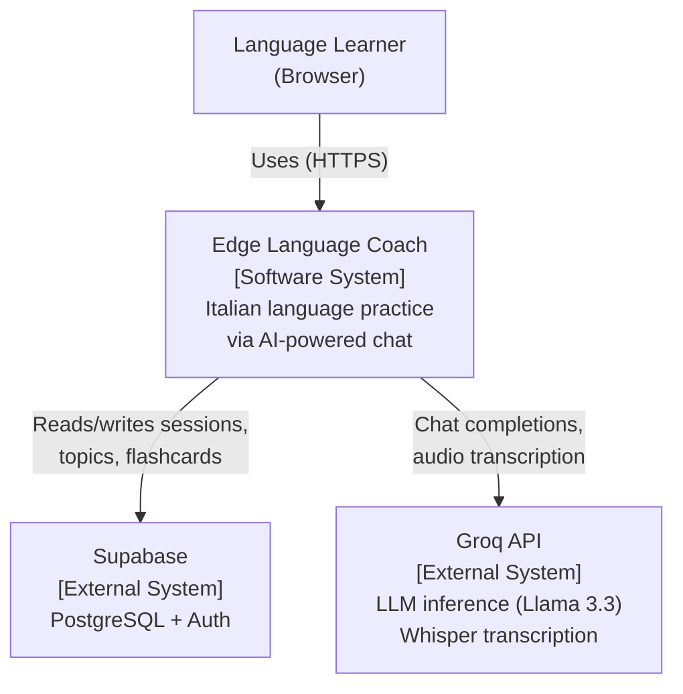
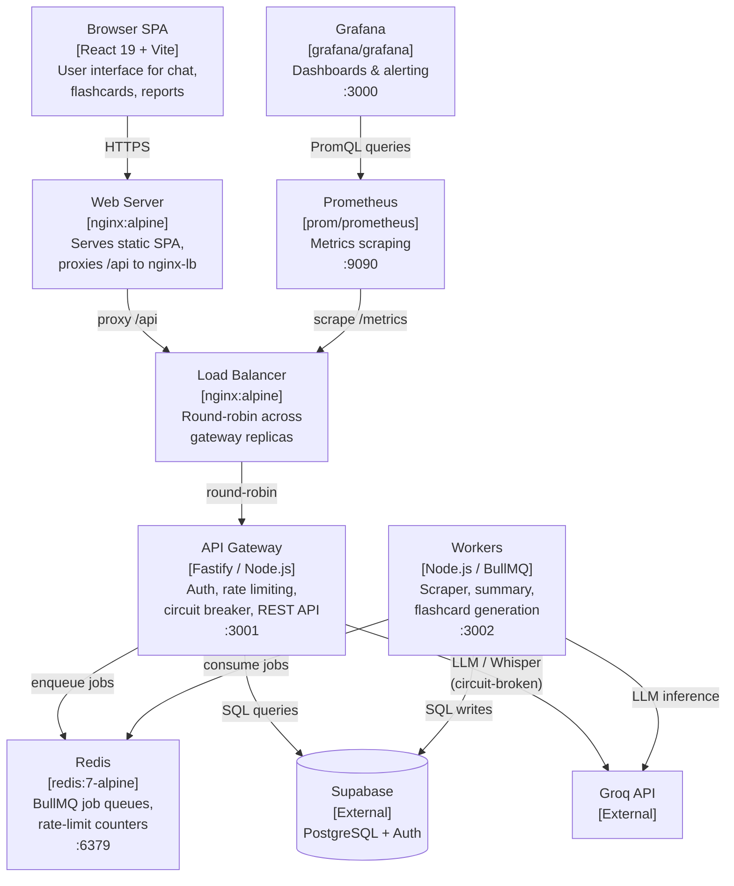
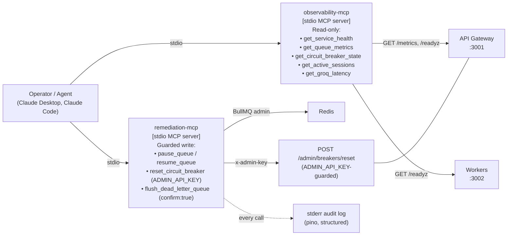
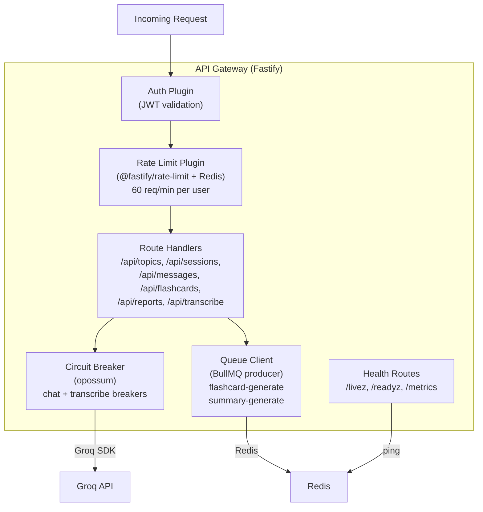

# C4 Architecture Diagrams

## Level 1 — System Context

## Level 2 — Container Diagram

## Level 2b — Operator Surface (Agentic MCP)

A separate plane from the user-request data flow. MCP clients (Claude Desktop, Claude Code, automated runbook agents) speak the stdio transport to two servers split by privilege.

Loop closure: detect (Prometheus / Grafana, not shown) → diagnose (`observability-mcp`) → remediate (`remediation-mcp`).

## Level 3 — Gateway Component Diagram

